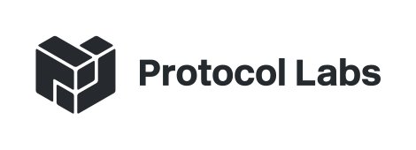
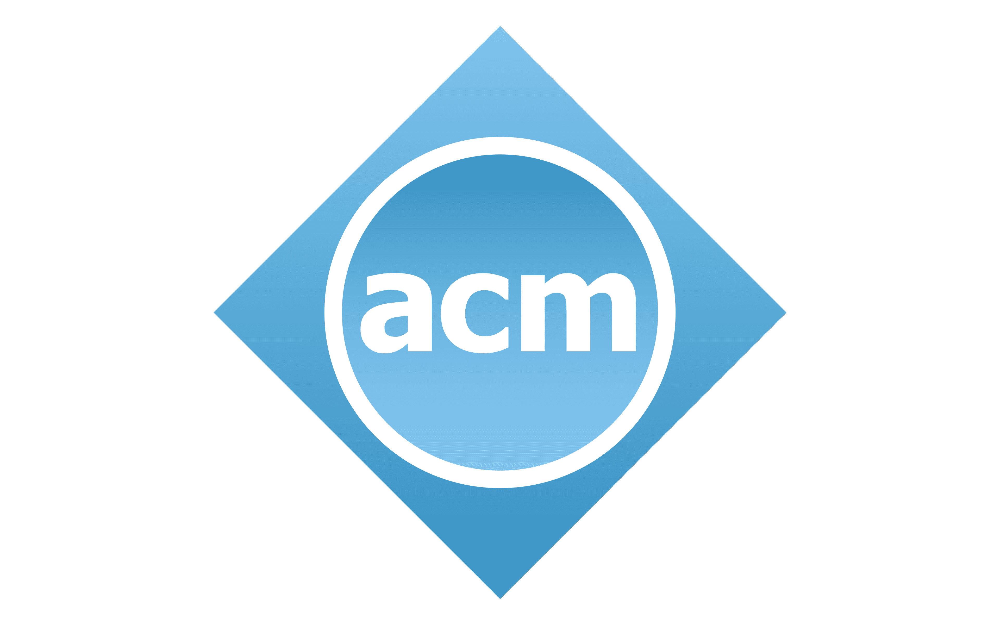
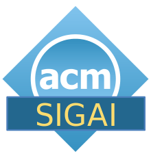
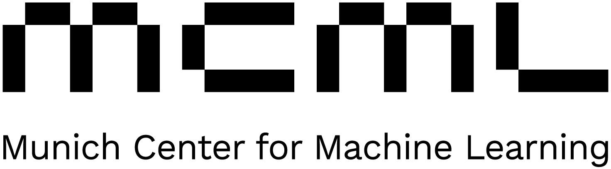
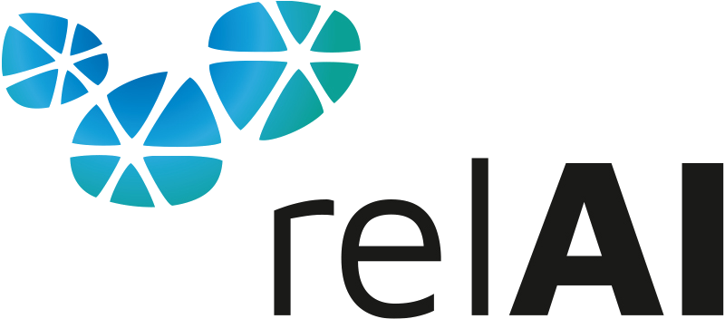

The Sixth ACM Conference on Equity and Access in Algorithms, Mechanisms, and Optimization (ACM EAAMO 2026) will be organized by Ludwig-Maximilians-Universität München and held from <b>November 5–7, 2026</b>, at Ludwig-Maximilians-Universität München, Germany.

  
<b>Registration for ACM EAAMO'26 is now open.</b> Register by <b>October 15, 2026</b> to get the early bird rate.

  <a class="register-button" href="/registration/">Register now</a>

<figure class="home-munich-photo">
  
  <figcaption>Munich, Germany. Photo by <a href="https://pixabay.com/photos/munich-architecture-germany-4792435/">iankelsall1</a> on Pixabay.</figcaption>
</figure>

  

    Dates
    <strong>November 5–7, 2026</strong>
  

  

    Venue
    <strong>Ludwig-Maximilians-Universität München</strong>
  

  

    Location
    <strong>Munich, Germany</strong>
  

<add-to-calendar-button 
  name="ACM EAAMO'26"
  description="The Sixth ACM Conference on Equity and Access in Algorithms, Mechanisms, and Optimization (ACM EAAMO 2026) will be organized by Ludwig-Maximilians-Universität München and held from November 5–7, 2026, at Ludwig-Maximilians-Universität München, Germany."
  startDate="2026-11-05"
  startTime="09:00"
  endDate="2026-11-07"
  endTime="18:00"
  timeZone="CET"
  location="https://conference.eaamo.org/"
  options="'Apple','Google','iCal','Outlook.com','Yahoo'"
></add-to-calendar-button>

- - -

## News
- [Registration](registration) for ACM EAAMO'26 is now open. Register by October 15, 2026 to get the early bird rate.
- The [Call for Posters](call_for_posters) is now open. Submit your work-in-progress poster by September 7, 2026.
- [Financial assistance applications](financial_assistance) are now open. Apply by August 25, 2026.
- Submission deadline is postponed by 1 week: new deadlines are May 8 (for abstract submission) and May 15 (for paper submission), respectively.
- Call for Papers is now available on this [link](cfp).

## About ACM EAAMO Conference

The event will highlight work across the research-to-practice pipeline that aims to ensure algorithmic systems play a broadly beneficial role in society, advancing equity and expanding access to opportunity for underserved communities. We invite submissions that draw on techniques from artificial intelligence and machine learning, mechanism design, optimization, operations, and economics, as well as perspectives from human-computer interaction and the social sciences that examine the societal embedding of these technologies. The conference will provide an inter-disciplinary forum for presenting research papers, problem pitches, survey and position papers, new datasets, and software demonstrations with the goal of bridging research and practice.

## Acknowledgements
We are grateful for the support from:

Gold Sponsor

    

Silver Sponsors

    
    

Bronze Sponsors

    
    

